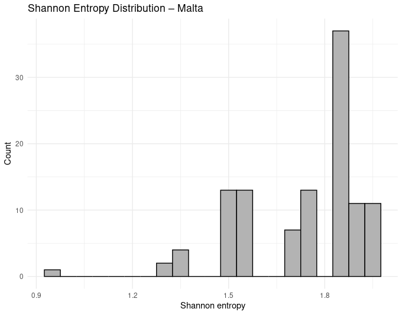
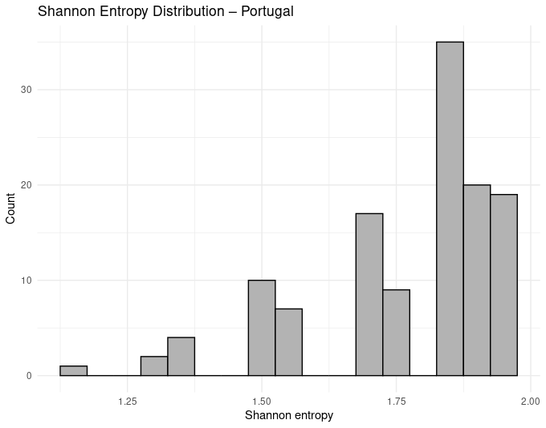
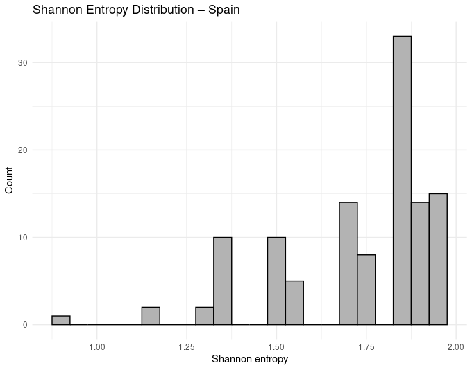

# MarKUS: Marker K-mers for Untargeted Sequencing


MarKUS provides a fast and efficient workflow for the extraction, count, and filtering of k-mers from .fastq, .fasta, and .fastq.gz files.

## Installation

```r
remotes::install_github("AldoDale/MarKUS", subdir = "MarKUS")
```
---

## How to use

An example dataset is available at https://github.com/AldoDale/MarKUS/tree/main/MarKUS/man/example_dataset.


### Merge paired files

If the sequencing data is split in strand 1 and 2 (or forward and reverse strand), the files should be first merged

```r

merge_pairs(path, pattern_s1, pattern_s2, output_ext)

#arguments

#  - path = path to the directory containing the files.

#  - pattern_s1 = pattern to recognize the first (or forward) strand files.

#  - pattern_s2 = pattern to recognize the second (or reverse) strand files.

#  -output_ext = the desired output extension (the same extension of input files is recommended).
```

#### Returns: a data.frame
```r

merged_files <- merge_pairs(path = "./example_dataset", pattern_s1 = "*_R1.fastq", "*_R2.fastq", output_ext = "fastq")

merged_files

#>       sample                              merged_path
#>1     Malta_1    ./example_dataset/Malta_1_merged.fastq
#>2     Malta_2    ./example_dataset/Malta_2_merged.fastq
#>3     Malta_3    ./example_dataset/Malta_3_merged.fastq
#>4     Malta_4    ./example_dataset/Malta_4_merged.fastq
#>5     Malta_5    ./example_dataset/Malta_5_merged.fastq
#>6  Portugal_1 ./example_dataset/Portugal_1_merged.fastq
#>7  Portugal_2 ./example_dataset/Portugal_2_merged.fastq
#>8  Portugal_3 ./example_dataset/Portugal_3_merged.fastq
#>9  Portugal_4 ./example_dataset/Portugal_4_merged.fastq
#>10 Portugal_5 ./example_dataset/Portugal_5_merged.fastq
#>11    Spain_1    ./example_dataset/Spain_1_merged.fastq
#>12    Spain_2    ./example_dataset/Spain_2_merged.fastq
#>13    Spain_3    ./example_dataset/Spain_3_merged.fastq
#>14    Spain_4    ./example_dataset/Spain_4_merged.fastq
#>15    Spain_5    ./example_dataset/Spain_5_merged.fastq

```
---

### Produce and count k-mers

To use this function, Jellyfish (https://github.com/gmarcais/Jellyfish) must be installed.

```r
count_kmers(x, kmer_size, threads)


#arguments

#  - x = data.frame with a "sample" column with sample names and a "merged_path" column
#        with the path to the fastq files. If merge_fastq() was used, the output of the
#        function can be used as input of count_kmers().
         
#  - kmer_size = the desired size of k-mers.

#  - threads = the number of threads to use.

```
#### Returns: a data.frame
```r


kmers <- count_kmers(merged_files, kmer_size = 10, threads = 10)

#>      sample                                 counts_db                                       kmer_txt
#>1     Malta_1    ./example_dataset/Malta_1_counts_R.jf    ./example_dataset/Malta_1_kmer_counts_R.txt
#>2     Malta_2    ./example_dataset/Malta_2_counts_R.jf    ./example_dataset/Malta_2_kmer_counts_R.txt
#>3     Malta_3    ./example_dataset/Malta_3_counts_R.jf    ./example_dataset/Malta_3_kmer_counts_R.txt
#>4     Malta_4    ./example_dataset/Malta_4_counts_R.jf    ./example_dataset/Malta_4_kmer_counts_R.txt
#>5     Malta_5    ./example_dataset/Malta_5_counts_R.jf    ./example_dataset/Malta_5_kmer_counts_R.txt
#>6  Portugal_1 ./example_dataset/Portugal_1_counts_R.jf ./example_dataset/Portugal_1_kmer_counts_R.txt
#>7  Portugal_2 ./example_dataset/Portugal_2_counts_R.jf ./example_dataset/Portugal_2_kmer_counts_R.txt
#>8  Portugal_3 ./example_dataset/Portugal_3_counts_R.jf ./example_dataset/Portugal_3_kmer_counts_R.txt
#>9  Portugal_4 ./example_dataset/Portugal_4_counts_R.jf ./example_dataset/Portugal_4_kmer_counts_R.txt
#>10 Portugal_5 ./example_dataset/Portugal_5_counts_R.jf ./example_dataset/Portugal_5_kmer_counts_R.txt
#>11    Spain_1    ./example_dataset/Spain_1_counts_R.jf    ./example_dataset/Spain_1_kmer_counts_R.txt
#>12    Spain_2    ./example_dataset/Spain_2_counts_R.jf    ./example_dataset/Spain_2_kmer_counts_R.txt
#>13    Spain_3    ./example_dataset/Spain_3_counts_R.jf    ./example_dataset/Spain_3_kmer_counts_R.txt
#>14    Spain_4    ./example_dataset/Spain_4_counts_R.jf    ./example_dataset/Spain_4_kmer_counts_R.txt
#>15    Spain_5    ./example_dataset/Spain_5_counts_R.jf    ./example_dataset/Spain_5_kmer_counts_R.txt

```
---

### Extract group-exclusive k-mers

This function is used to detect k-mers exclusive of one group of samples. A minimum prevalence value can be set.

```r
get_shared_kmers(x, data, group, min_occurrence)


#arguments

#  - x = data.frame with a "sample" column with sample names and a "kmer_txt" column
#        with the path to the k-mers .txt files. The dataframe is created by the function count_kmers().
         
#  - data = a data.frame with the metadata. It must have a "sample" column (identical to the x data.frame column).

#  - group = the name of the metadata column to use as grouping factor.

#  - min_occurrence = the minimum number of samples the k-mers must be present in to be kept.

```

#### Returns: a named vector
```r
#to run the example, a sample metadata object can be created with:

metadata <- data.frame(sample = kmers$sample, group = gsub("_[1-9]", "", kmers$sample))


shared_kmers <- get_shared_kmers(kmers, data, group = “origin”, min_occurrence = 4)


shared_kmers

#>                                          Malta                                        Portugal                                        Spain 
#>   "./example_dataset/Malta_shared_kmers_R.txt" "./example_dataset/Portugal_shared_kmers_R.txt" "./example_dataset/Spain_shared_kmers_R.txt"

```

---

###Calculate information content of k-mers

This function calculates, based on the frequency of nitrogenous bases, the information content of k-mers. To find the most informative markers, the user might want to filter the k-mers based on this index.

```r
calculate_shannon(x)


#arguments

# - x = a named vector. Names must indicate the group, values must be the path to the "<group>_shared_kmers_R.txt" file.

```

#### Returns: a list of named vectors and plots.
```r
shannon <- calculate_shannon(shared_kmers)

lapply(shannon$shannon_values, head)

#>$Malta
#>AAAAGTGGAA AAAGTAGTGT AAATAACAGC AAATTCGCCT AACCCATCTA AAGAAACAGC 
#>  1.295462   1.570951   1.570951   1.895462   1.521928   1.370951 
#>
#>$Portugal
#>AAAAACTGCA AAAATTTTGG AAACGCTAGT AAACTTGACT AAAGGACTCG AAATGCAGTG 
#>  1.570951   1.521928   1.921928   1.846439   1.846439   1.846439 
#>
#>$Spain
#>AAAACATAAT AAACGCAAGA AAATTACATA AACCGATCGG AACTCTCCAG AAGAAATAAA 
#> 1.1567796  1.3709506  1.2954618  1.8954618  1.8464393  0.9219281 
 
shannon$plots

#>$Malta

#>$Portugal

#>$Spain
 

```
<p align="center">
  
  
  
</p>

---

### Filter k-mers based on information content


```r

filter_shannon_values(x,  threshold)

#arguments

# - x = a list of named vectors (e.g., shannon$values).
# - threshold = minimum shannon value of sequences to be retained.
```

##### Returns: a list of named vectors

```r

filtered_shannon <- filter_shannon_values(shannon$shannon_values,  threshold = 1.8)

lapply(filt_shann, head)

#>$Malta
#>AAATTCGCCT AAGACTTTGT AAGCCCTATC AATCCAACGG AATCTACCGC AATGACTAGG 
#>  1.895462   1.846439   1.846439   1.846439   1.846439   1.846439 
#>
#>$Portugal
#>AAACGCTAGT AAACTTGACT AAAGGACTCG AAATGCAGTG AAATGTACGT AAATTACGCT 
#>  1.921928   1.846439   1.846439   1.846439   1.846439   1.846439 
#>
#>$Spain
#>AACCGATCGG AACTCTCCAG AAGTCGGACT AATCGTAGCT AATTAATGCG ACACGCGAAT 
#>  1.895462   1.846439   1.970951   1.970951   1.846439   1.846439 

```
---

### Filter k-mers based on the edit distance

The sequences which were found to be unique might be biased by mutations and sequencing errors (substitution, addition, deletion, or frameshift). The function filter_ed() allows to detect possible biases by calculating the number of edits that have to be done on a string (in this case a sequence) to make it identical to another string, and filter them based on a threshold. The function is based on the package stringdist (https://github.com/markvanderloo/stringdist) and uses its methods.

```r

filter_ed(x, threshold, method, chunk_size, PPARAM)

#arguments

# - x = a list of named vectors (e.g., shannon$values).
# - threshold = minimum number of edits for a sequence to be retained as unique. 
# - method = one of the methods inherited by stringdist package.
# - chunk_size = number of lines to be processed together. Useful when dealing with big datasets.
# - PPARAM = parameter for the parallelization of processes.
```

##### Returns: a list of named vectors

```r

filt_edit_dist <- filter_ed(filtered_shannon, threshold = 3, method = "lv", chunk_size = 1, BPPARAM = BiocParallel::MulticoreParam())

filt_edit_dist

#$Malta
# [1] "AAGACTTTGT" "AAGCCCTATC" "AATGACTAGG" "ACACCGATCT" "ACACCTGCTG" "ACAGTCGATA" "ACGAGTGGAC" "ACGGGCTCCT" "ACTCGACTAA" "ACTCGTTTGC" "ACTCTAATCG" "AGAATTTGCA" "AGGGAGACTC" "AGGTCGTTCG"
#[15] "AGGTGCGCAC" "AGTTACGCTG" "ATCCGATTGA" "ATGTCTGCTA" "ATTTGCGTAA" "CATGAGCAAG" "CGGTATCGGA" "CTATTGGGTC" "GACATAGTGA" "GCTGGGTTCA" "GGTACAGACC" "GTCGTTCAAC" "TAGCTTGTGA" "TCTACTGGAA"
#
#$Portugal
# [1] "AAACTTGACT" "AAAGGACTCG" "AACGGATTGT" "AATGCTTCTG" "ACCTTCAAGG" "ACGCGTCCGA" "ACTCACCTGA" "AGACGTAATG" "AGCGGATCAC" "AGCTTAGACA" "AGGTACCCTG" "ATAGTGCCCC" "ATTGCGTAGG" "CAATCGGCTG"
#[15] "CATGAATATC" "CCGGAGTAAG" "CCGGTTTTAA" "CGACAAGTCC" "CTGATACAAC" "CTTTGGATAA" "GCTATCAGCA" "GGAAGTCTCC" "GGACTGCTAC" "GGCGACAGTA" "GGTTACCCCA" "GTCAATTCAC" "GTTGCTTAAA" "TAAAGCTGCA"
#[29] "TCGTCCTAAA" "TCTGGAACCA"
#
#$Spain
# [1] "AACCGATCGG" "AACTCTCCAG" "ACACGCGAAT" "ACCAGTTTGA" "ACCATAGCAG" "ACGCGACTAT" "ACGTTAGGGC" "AGAGCCTTTA" "ATAAGCTAGG" "ATTATGCAAC" "CAGTGACTTC" "CATAGGCTAA" "CCACTCGGGA" "CCTGCTGTAA"
#[15] "CGATTAGAAG" "CGCAAATGCA" "CGCCGTATTA" "CGGCTGAAGA" "CGTACTCCAA" "CTTGAATCCC" "GACCTCAATC" "GCCAGGTTAC" "GCTGTTCGAC" "GGTGCCAGAC" "GTCGCGTTGA" "TACAGTAGCA" "TACCGGCTCA" "TCGTCACACA"

```
---

### Filtering based on the presence of repeated patterns

Sequences that passed the previous filtering steps might present repeated patterns which lower their informativeness in some context.

```r

filter_repeated_seqs(x, mode, pattern, min_repeats, kmer_length) 


#arguments

# - x = a list of named vectors (e.g., shannon$values).
# - mode = one of "pattern" or "any". With "pattern" the user needs to input the pattern to search for. "any" is used to search any             repeated sequence.
# - pattern = the pattern to search if mode = "pattern".
# - min_repeats = number of times a sequence or pattern needs to be present to exclude the k-mer.
# - kmer_length = the length of the sequence to search for if it is repeated if mode = "any".
```

##### Returns: a list of data.frames

```r

# By using 'mode = "pattern"' we can remove the k-mers which present the <pattern> <min_repeats> times.
# In this example, we want to remove sequences where "AT" is repeated at least 2 times.

filt_pattern <- filter_repeated_seqs(fe, mode = "pattern", pattern = "AT", min_repeats = 2, kmer_length = NULL) 

filt_pattern

#>$Malta
#>DataFrame with 28 rows and 2 columns
#>       sequence       group
#>    <character> <character>
#>1    AAGACTTTGT       Malta
#>2    AAGCCCTATC       Malta
#>3    AATGACTAGG       Malta
#>4    ACACCGATCT       Malta
#>5    ACACCTGCTG       Malta
#>...         ...         ...
#>24   GCTGGGTTCA       Malta
#>25   GGTACAGACC       Malta
#>26   GTCGTTCAAC       Malta
#>27   TAGCTTGTGA       Malta
#>28   TCTACTGGAA       Malta
#>
#>$Portugal
#>DataFrame with 29 rows and 2 columns
#>       sequence       group
#>    <character> <character>
#>1    AAACTTGACT    Portugal
#>2    AAAGGACTCG    Portugal
#>3    AACGGATTGT    Portugal
#>4    AATGCTTCTG    Portugal
#>5    ACCTTCAAGG    Portugal
#>...         ...         ...
#>25   GTCAATTCAC    Portugal
#>26   GTTGCTTAAA    Portugal
#>27   TAAAGCTGCA    Portugal
#>28   TCGTCCTAAA    Portugal
#>29   TCTGGAACCA    Portugal
#>
#>$Spain
#>DataFrame with 28 rows and 2 columns
#>       sequence       group
#>    <character> <character>
#>1    AACCGATCGG       Spain
#>2    AACTCTCCAG       Spain
#>3    ACACGCGAAT       Spain
#>4    ACCAGTTTGA       Spain
#>5    ACCATAGCAG       Spain
#>...         ...         ...
#>24   GGTGCCAGAC       Spain
#>25   GTCGCGTTGA       Spain
#>26   TACAGTAGCA       Spain
#>27   TACCGGCTCA       Spain
#>28   TCGTCACACA       Spain


#In this example we want to remove sequences with any k-mer of length 2 repeated at least 2 times.

filt_any <- filter_repeated_seqs(fe, mode = "any", pattern = NULL, min_repeats = 2, kmer_length = 2)

filt_any

#>$Malta
#>DataFrame with 10 rows and 2 columns
#>      sequence       group
#>   <character> <character>
#>1   AAGACTTTGT       Malta
#>2   AAGCCCTATC       Malta
#>3   AATGACTAGG       Malta
#>4   ACAGTCGATA       Malta
#>5   ACTCGTTTGC       Malta
#>6   AGAATTTGCA       Malta
#>7   AGTTACGCTG       Malta
#>8   ATTTGCGTAA       Malta
#>9   CTATTGGGTC       Malta
#>10  GCTGGGTTCA       Malta
#>
#>$Portugal
#>DataFrame with 12 rows and 2 columns
#>       sequence       group
#>    <character> <character>
#>1    AAAGGACTCG    Portugal
#>2    AACGGATTGT    Portugal
#>3    ACCTTCAAGG    Portugal
#>4    AGACGTAATG    Portugal
#>5    AGCGGATCAC    Portugal
#>...         ...         ...
#>8    CAATCGGCTG    Portugal
#>9    CGACAAGTCC    Portugal
#>10   CTTTGGATAA    Portugal
#>11   GGCGACAGTA    Portugal
#>12   TCTGGAACCA    Portugal
#>
#>$Spain
#>DataFrame with 10 rows and 2 columns
#>      sequence       group
#>   <character> <character>
#>1   ACCAGTTTGA       Spain
#>2   ACGTTAGGGC       Spain
#>3   CAGTGACTTC       Spain
#>4   CCACTCGGGA       Spain
#>5   CGTACTCCAA       Spain
#>6   CTTGAATCCC       Spain
#>7   GCCAGGTTAC       Spain
#>8   GCTGTTCGAC       Spain
#>9   GGTGCCAGAC       Spain
#>10  TACCGGCTCA       Spain

```

---

## Contacts

For questions, bug reports, and any kind of request, please feel free to contact me at: aldo.dalessandro@unifi.it


